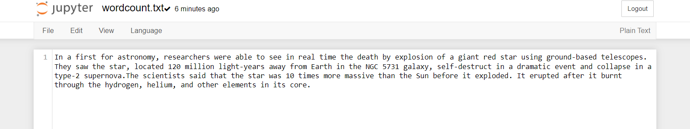

# Word-count
## AIM:
To write a python program for getting the word count from a text.
## EQUIPEMENT'S REQUIRED: 
PC
Anaconda - Python 3.7
## ALGORITHM: 
### Step 1: 
Create a file and add some content into it.
### Step 2:
Open file using with keyword/built-in function in read mode.
### Step 3: 
Use read() to read the contents of the file.
### Step 4: 
Split the lines using split().
### Step 5:  
Use len() to find the number of elements that got split and print the Output.
### Step 6: 
Print the Output.
## PROGRAM:
```
with open("wordcount.txt","r") as fp:
    data=fp.read()
    word=data.split()

    print("Total number of words:",len(word))  
```
### OUTPUT:
## SAMPLE INPUT:

## SAMPLE OUTPUT:


## RESULT:
Thus the program is written to find the word count from a text.
